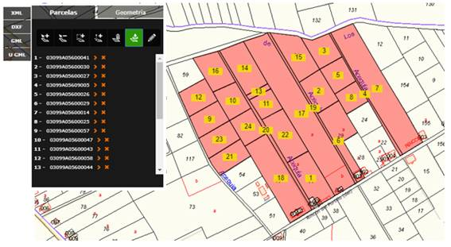

# Catastro

 Se desea considerar la información correspondiente al catastro de viviendas de un determinado municipio de Tenerife. En el municipio existe una serie de zonas urbanas en las cuales se han edificado un conjunto de viviendas, pudiendo ser:
- **Viviendas unifamiliares o casas** en las que sólo habita una familia.
- **Bloques de pisos** en los cuales existe un conjunto de viviendas, indeterminado a priori, en cada una de las cuales habita una familia.

Se considera mantener la información correspondiente a las personas que viven en cada una de las viviendas, así como el cabeza de familia de las personas que habitan o son propietarias de las viviendas.
Para cada vivienda, además de la información correspondiente a las características de las mismas, es necesario conocer la persona propietaria de la misma.

Además se debe tener en cuenta que:
- Toda persona habita en una y sólo una vivienda, la cual es considerada como su vivienda o residencia principal.
- Cada vivienda tiene uno y sólo un propietario.
- Las viviendas se encuentran en una única zona urbana correspondiente al municipio.
- Las zonas urbanas en las que está dividido geográficamente el municipio tienen nombres diferentes.
- En cada zona urbana del municipio existen una serie de calles en las que se construyen las viviendas.
Los nombres de las calles son únicos para cada municipio con independencia de la zona urbana en la que se encuentren.
- En el contexto del problema, una familia es un conjunto de personas que tienen una relación familiar directa y que habita, o no, en una misma vivienda. Este conjunto podrá ser unario.
- Como se indica en el enunciado del problema, las viviendas pueden ser casas unifamiliares o bloques en los cuales existen una serie de pisos individuales.

Se pide:
  1. Proponer las frases que describan el problema.
  2. Identifica las posibles __entidades y las relaciones__.
  3. Generar los entidades y relaciones de cada frase que hayas detectado, sin indicar cardinalidad, etc.
  4. Monta correctamente todas las entidades y sus relaciones.
  5. Colocar los atributos a cada entidad e interrelación.
  6. Indica la cardinalidad de las relaciones.

<!-- 

      
PASO 1 - PULSA PARA VER RESULTADO
   
   
  
  
  
   

-->

