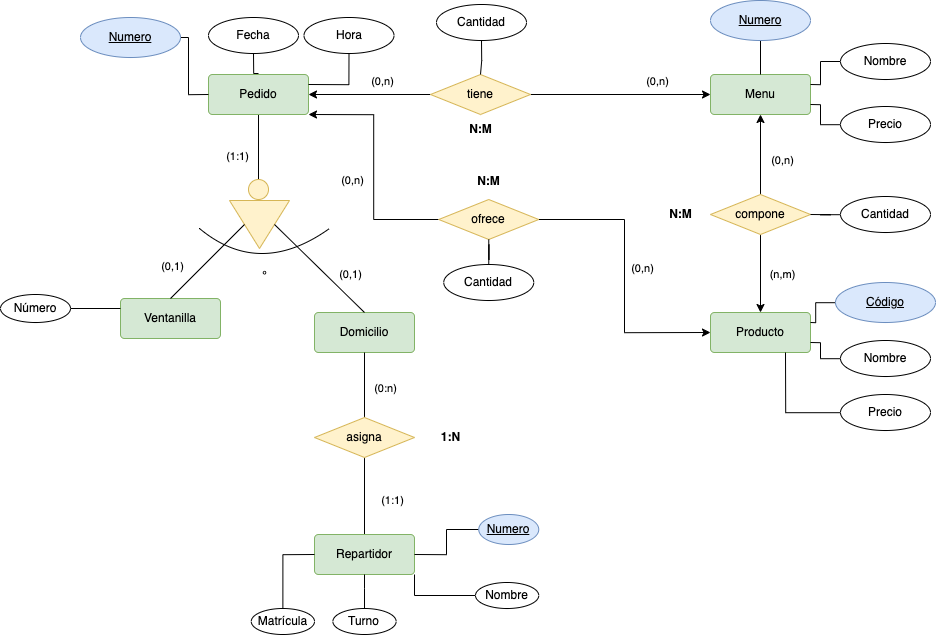

# Comida Rápida

Un establecimiento de comida rápida quiere desarrollar un software para gestionar los pedidos y repartos a domicilio, así como obtener estadísticas de los mismos.
Se quiere registrar la siguiente información:
- Los pedidos para consumir en el establecimiento se recogen en ventanilla y los de entrega a domicilio se recogen por teléfono.
- Todos los pedidos van numerados correlativamente. Por cada uno de ellos se recoge la fecha y hora del pedido.
- En los pedidos de ventanilla se registra el nº de ventanilla.
- En los pedidos a domicilio se registra el teléfono, población y dirección
- Se cuenta con una serie de repartidores identificados por un número, con el nombre completo, una matrícula de moto y un turno (mañana, tarde, noche).
- A cada pedido a domicilio se le asigna un repartidor
- El establecimiento ofrece una serie de productos (hamburguesa simple, doble, alemana, coca-cola pequeña mediana, grande, ensalada...)identificados por un código y con un nombre y precio.
- Se ofrecen también menús especiales compuestos por un conjunto de productos. Los menús están numerados, tienen un nombre de menú y un precio.
- Un pedido puede constar de varios menús en diferentes cantidades y/o varios productos en diferentes cantidades.

Se pide:
  1.Proponer las frases que describan el problema.
  2. Identifica las posibles __entidades y las relaciones, y valores de dominio si existen__.
  3. Generar los entidades y relaciones de cada frase que hayas detectado, sin indicar cardinalidad, etc.
  4. Monta correctamente todas las entidades y sus relaciones.
  5. Colocar los atributos a cada entidad e interrelación.
  6. Indica la cardinalidad de las relaciones.

      
Frases a tener en cuenta
   

  - Los pedidos para consumir en el establecimiento se recogen en ventanilla y los de entrega a domicilio
se recogen por teléfono
    > Los pedidos se pueden recoger en ventanilla o domicilio. Inicialmente ventanilla, y domicilio sería un valor de dominio.
  - En los pedidos de ventanilla se registra el nº de ventanilla.
    > Ventanilla se transforma en __entidad__, dado que tiene una propiedad (número). 
  - En los pedidos a domicilio se registra el teléfono, población y dirección.
    > Los pedidos a domicilio se han convertido en entidad ya que los de ventanilla tienen propiedades. No obstante los pedidos a domicilio tienen las suyas propias (teléfono, población, y dirección).
  - Cada pedido se le asigna un repartidor.
  - Se cuenta con una serie de repartidores identificados por un número, con el nombre completo, una matrícula de moto y un turno (mañana, tarde, noche).
    > Repartidor se convierte en entidad, dado que se produce una acción con domicilio, y posee sus propiedades (matrícula, ...). _Domicilio asigna Repartidor_.
  - El establecimiento ofrece una serie de productos (hamburguesa simple, doble, alemana, coca-cola (pequeña mediana, grande), ensalada...) identificados por un código y con un nombre y precio.      
    > El _establecimiento ofrece productos_, la pregunta es __¿cómo?__,(a través del pedido, al igual que los menús __no__) y estos tienen propiedades (código, nombre y precio). 
  - Se ofrecen también menús especiales compuestos por un conjunto de productos. Los menús están numerados, tienen un nombre de menú y un precio.
    > El _establecimiento ofrece menus compuestos (+1 producto). Las propiedades tienen un número, nombre y precio_.
  - Un pedido puede constar de varios menús en diferentes cantidades y/o varios productos en diferentes cantidades.  
    > Tanto las relación entre establecimiento con menú o productos tiene una propiedad llamada cantidad.

      
Entidades, Relaciones y Valores de Dominio si existen
   
  
  - Entidades:
    > Pedido, Menú, Ventanilla, Domicilio, Repartidor, y Producto.
  - Relaciones:  
    > ofrece, tiene, compone, asigna.

      
Generar entidades y relaciones
   
   
  
  > Pedido __tiene__ Menú.
  > Pedido __jerarquía__: Ventanilla/Domicilio.
  > Menú __compone__ producto.
  > Pedido __ofrece__  producto.
  > Domicilio __asigna__ Repartidor.

      
Diagrama, atributos y cardinalidades
   
   
  

