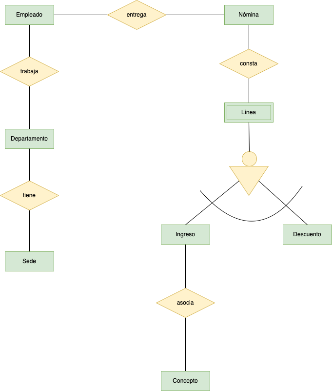
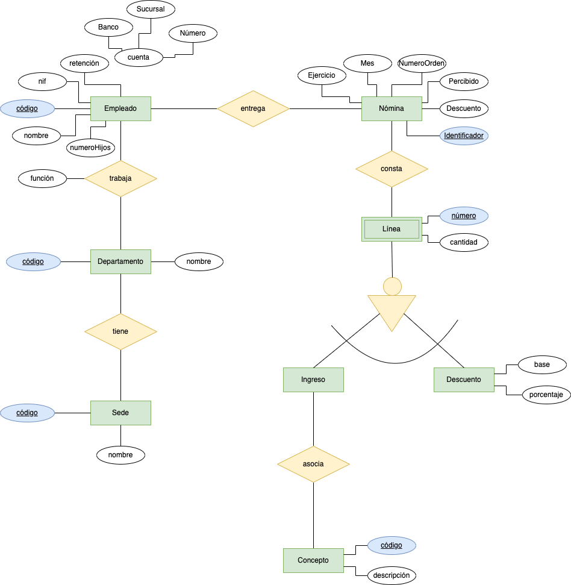
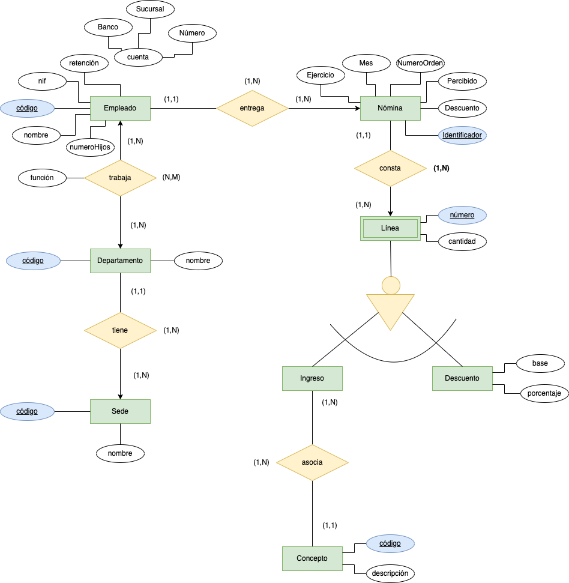

# Nóminas

Una Empresa decide informatizar su gestión de nóminas. Del resultado del análisis realizado, se obtiene la siguiente información:

- A cada empleado se le entregan múltiples nóminas a lo largo de su vida laboral en la empresa y al menos una mensualmente.
- A cada empleado se le asigna un número de empleado en el momento de su incorporación a la empresa, y éste es el número usado a efectos internos de identificación. Además, se registran el Número de Identificación Fiscal del empleado, nombre, número de hijos, porcentaje de retención para Hacienda, datos de cuenta corriente en la que se le ingresa el dinero (banco, sucursal y número de cuenta) y departamentos en los que trabaja.
- Un empleado puede trabajar en varios departamentos y en cada uno de ellos trabajará con un función distinta.
- De un departamento se mantiene el nombre y cada una de sus posibles sedes.
- Son datos propios de una nómina el ingreso total percibido por el empleado y el descuento total aplicado.
- La distinción entre dos nóminas se hará, además de mediante el número de identificación del empleado, mediante el ejercicio fiscal y número de mes al que pertenece y con un número de orden en el caso de varias nóminas recibidas el mismo mes.
- Cada nómina consta de varias líneas (al menos una de ingresos) y cada línea se identifica por un número de línea dentro de la correspondiente nómina.
- Una línea puede corresponder a un ingreso o a un descuento. En ambos casos, se recoge la cantidad que corresponde a la línea (en positivo si se trata de un ingreso o en negativo si se trata de un descuento); en el caso de los descuentos, se recoge la base sobre la cual se aplica y el porcentaje que se aplica para el cálculo de éstos.
- Toda línea de ingreso de una nómina responde a un único concepto retributivo.
- En un mismo justificante, puede haber varias líneas que respondan al mismo concepto retributivo.
- De los conceptos retributivos se mantiene un código y una descripción.

Se pide:
  1. Proponer las frases que describan el problema.
  2. Identifica las posibles __entidades y las relaciones__.
  3. Generar los entidades y relaciones de cada frase que hayas detectado, sin indicar cardinalidad, etc.
  4. Monta correctamente todas las entidades y sus relaciones.
  5. Colocar los atributos a cada entidad e interrelación.
  6. Indica la cardinalidad de las relaciones.

      
SOLUCIÓN
   
   

  1. Proponer las frases que describan el problema.
  > Las frases vienen propuestas por puntos en el problema para su fácil identificación.
  2. Identifica las posibles __entidades y las relaciones__.
  > Las entidades que se identifican:
    - Empleado.
    - Nómina.
    - Departamento.
    - Sede.
    - Línea.
    - Ingreso.
    - Descuento.
    - Concepto (Concepto Retributivo).

  > Relaciones:
    - Trabaja (Empleado -> Departamento).
    - Tiene (Departamento -> Sede).
    - Entrega (Empleado -> Nómina).
    - Consta (Nómina -> Línea).
    - Asocia (Ingreso -> Concepto). 
  3. Generar los entidades y relaciones de cada frase que hayas detectado, sin indicar cardinalidad, etc.

  4. Monta correctamente todas las entidades y sus relaciones.

  5. Colocar los atributos a cada entidad e interrelación.

  6. Indica la cardinalidad de las relaciones.

