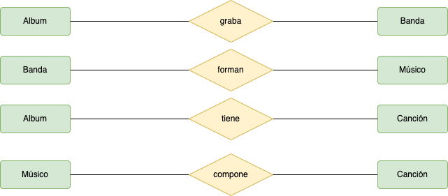
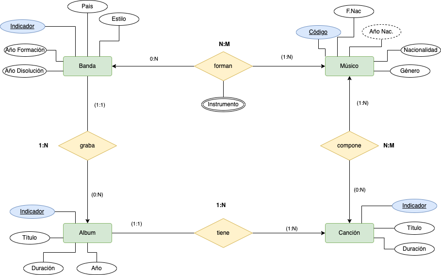

# Empresa Discográfica

 

Una empresa discográfica emergente de Canarias quiere almacenar y organizar eficientemente la información sobre grupos musicales, canciones y músicos. Para ello se hace necesario crear una base de datos que incluya los siguientes requerimientos y consideraciones:
- Un Músico se identifica por un código de músico, su nombre, su fecha de nacimiento, su año de fallecimiento, su género y su nacionalidad.
- Una Banda tiene un identificador de banda, el nombre del grupo, el año de formación, el año de disolución, el estilo musical y el país de origen. El estilo musical sólo puede tomar los valores:Blues, Country, Heavy, Jazz, Pop,Punk, Reggae ,Rock, Soul, Thrash, Techno.
- Un Álbum se caracteriza por incluir un identificador de álbum, su título, el año de publicación, su duración y el identificador del grupo que lo ha grabado.
- Una Canción almacena su identificador de canción, su título, su duración y el identificador del álbum al que pertenece.
- Es necesario también mantener información sobre los músicos que forman parte, es decir, son miembros de un grupo o grupos musicales, así como del instrumento que toca el músico en el grupo, existiendo la posibilidad de que un músico toque más de un instrumento en un grupo.
- Así mismo, también se debe disponer de información sobre las canciones y el músico o músicos que las han compuesto. En este sentido, como es lógico y habitual, un músico puede componer varias canciones y, también, una canción puede estar compuesta por más de un músico.

Se pide:
1. Proponer las frases que describan el problema.
2. Identifica las posibles __entidades, relaciones, valores de domino,etc__.
3. Generar los entidades y relaciones de cada frase que hayas detectado, sin indicar cardinalidad, etc.
4. Monta correctamente todas las entidades y sus relaciones.
5. Colocar los atributos a cada entidad e interrelación.
6. Indica la cardinalidad de las relaciones, y explicar aquellas que se requieran necesarias.

      
FRASES A TENER EN CUENTA

  En primer lugar, en la lectura inicial del texto identificamos las siguientes entidades: __músico, banda, canción, y álbum__.
Frases importantes:
  - Una Banda tiene un identificador de banda, el nombre del grupo, el año de formación, el año de disolución, el estilo musical y el país de origen. El estilo musical sólo puede tomar los valores: Blues, Country, Heavy, Jazz, Pop,Punk, Reggae ,Rock, Soul, Thrash, Techno.
    > Nota: Observamos las propiedades de banda, así como su _clave primaria (identificador)_ y los _valores de dominio_ que tiene la propiedad estilo musical _(Blues, Country, Heavy, Jazz, Pop,Punk, Reggae ,Rock, Soul, Thrash, Techno)_. __Al tratarse de valores de dominio no se representan en el diagrama ER__.
  - Un Álbum se caracteriza por incluir un identificador de álbum, su título, el año de publicación, su duración y el identificador del grupo que lo ha grabado. 
    > Nota: Vemos las propiedades de álbum y que se relaciona con grupo. Hemos de prestar atención (el identificador del grupo que lo ha grabado). Esto quiere decir que _un álbum es grabado por un grupo_.
  - Una Canción almacena su identificador de canción, su título, su duración y el identificador del álbum al que pertenece. 
    > Nota: Vemos las propiedades de la entidad canción y la relación (_identificador del álbum al que pertenece_). Es muy similar al caso anterior.
  - Es necesario también mantener información sobre los músicos que forman parte, es decir, son miembros de un grupo o grupos musicales, así como del instrumento que toca el músico en el grupo, existiendo la posibilidad de que un músico toque más de un instrumento en un grupo..
    > Nota: Como vemos aquí, existe una relación entre los músicos y la banda a la que pertenecen. Es importante prestar atención a la propiedad _instrumento_ e indicar de que tipo especial es.
  - Así mismo, también se debe disponer de información sobre las canciones y el músico o músicos que las han compuesto. En este sentido, como es lógico y habitual, un músico puede componer varias canciones y, también, una canción puede estar compuesta por más de un músico. 
    > Nota: Por último vemos la relación entre el músico/s, que han compuesto una canción.  
   

      
PASO 2

   
  
   
    

      
 PASO 3

   
  
   
    

      
SOLUCIÓN

   
  
   
    

      
SOLUCION B

   
  
   
    

