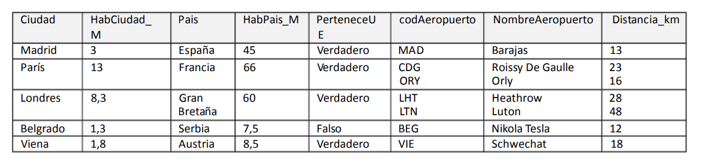

# Gestión de Aeropuertos 
Se ha creado una base de datos con los datos de ciudades y sus aeropuertos. Los campos y los tipos de datos son los que se indican a continuación:
- Ciudad: Nombre de la ciudad (único).
- HabCiudad_M: número de habitantes de la ciudad en millones. 
- País: País en el que se encuentra la ciudad.
- HabPais_M: Número de habitantes del país en millones.
- PerteneceUE: campo booleano. TRUE si el país Pertenece a la Unión Europea; FALSE, no pertenece a la Unión Europea. 
- codigoAeropuerto: único.
- NombreAeropuerto: único.
- Distancia_km: distancia del aeropuerto a la ciudad en km.

La representación de la información dentro de la BBDD es la siguiente:

 
 

Se pide:
1. Indicar claves candidatas
2. Comprobar si se cumple la 1ª Forma Normal
3. Normalizar si no se cumple el apartado 2
4. Determinantes sobre las tablas resultado del apartado 3
5. Indicar claves candidatas de todas las tablas resultantes

<!-->
  

      
PULSA PARA VER LA SOLUCIÓN

   
  
   

 

-->

 
