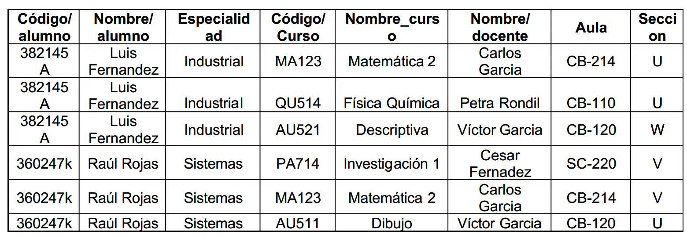

# Matrícula alumnado

<!--

Tenemos una __gestion de alumnado__ que tiene como objetivo la gestión de la información de la matrícula de los alumnos.

__Matrícula__

La representación de la información dentro de la BBDD es la siguiente:

Se pide:

1. Comprobar si se cumple la 1ª Forma Normal.
2. Normalizar si no se cumple el apartado 2.
3. Comprobar si se cumple la 2ª Forma Normal.
4. Normalizar si no se cumple el apartado 4.
5. Comprobar si se cumple la 3ª Forma Normal.
6. Normalizar si no se cumple el apartado 5.
7. Indicar claves de todas las tablas resultantes.
9. Genera el __diagrama E/R resultante__.

-->

